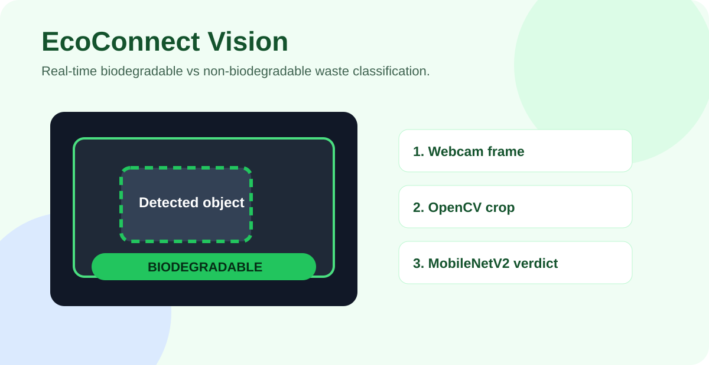

# EcoConnect Vision

EcoConnect Vision is a real-time computer-vision waste classifier. It uses a webcam feed, OpenCV motion isolation, and a MobileNetV2-based Keras model to classify visible waste as biodegradable or non-biodegradable.



## Repository Description

**GitHub description:** Real-time computer-vision waste classifier using OpenCV motion isolation and a MobileNetV2 Keras model to identify biodegradable vs non-biodegradable materials.

Recommended topics:

`computer-vision`, `opencv`, `tensorflow`, `keras`, `mobilenetv2`, `waste-classification`, `sustainability`, `recycling`, `python`, `jupyter-notebook`

## Why It Exists

Waste sorting is easiest when feedback is immediate. This project acts as the AI vision engine for a broader EcoConnect ecosystem by showing how lightweight computer vision can classify materials in real time.

## Features

- Real-time webcam inference.
- OpenCV background subtraction with `MOG2`.
- Contour detection and dynamic region-of-interest cropping.
- MobileNetV2 transfer-learning classifier.
- HUD-style visual overlay rendered through OpenCV.
- Binary confidence output for biodegradable vs non-biodegradable classification.

## Technical Stack

- Python
- TensorFlow / Keras
- OpenCV
- NumPy
- MobileNetV2 transfer learning
- Jupyter Notebook workflow

## Model Performance

The model was trained on a custom waste image dataset.

- Training accuracy: approximately 96 percent.
- Validation accuracy: approximately 90 percent.

Actual performance depends on lighting, background stability, camera quality, class balance, and the real-world materials being tested.

## How It Works

```text
Webcam frame
  -> background subtraction
  -> contour detection
  -> object crop
  -> MobileNetV2 classifier
  -> biodegradable / non-biodegradable verdict
  -> colored HUD feedback
```

Instead of using a heavier object-detection model, the project uses a hybrid approach:

1. OpenCV isolates movement in the frame.
2. The largest relevant contour is cropped as the object region.
3. The crop is resized and passed to the trained Keras model.
4. The UI shows the classification with a visual bounding box.

## Local Setup

Install dependencies:

```bash
pip install tensorflow opencv-python numpy
```

Run the notebook:

```text
biodeg.ipynb
```

The repository currently includes `waste_scanner_model.keras`. If you retrain the model, generate or replace that file through the notebook.

## Repository Structure

```text
EcoConnect-Vision/
  biodeg.ipynb
  waste_scanner_model.keras
  README.md
  docs/
    readme-preview.svg
```

## Notes

- Keep the webcam background still for better motion isolation.
- Test in consistent lighting.
- This is a prototype vision engine, not a production recycling compliance system.
- Real deployment should include a larger dataset, more classes, model evaluation reports, edge-device profiling, and hardware integration.

